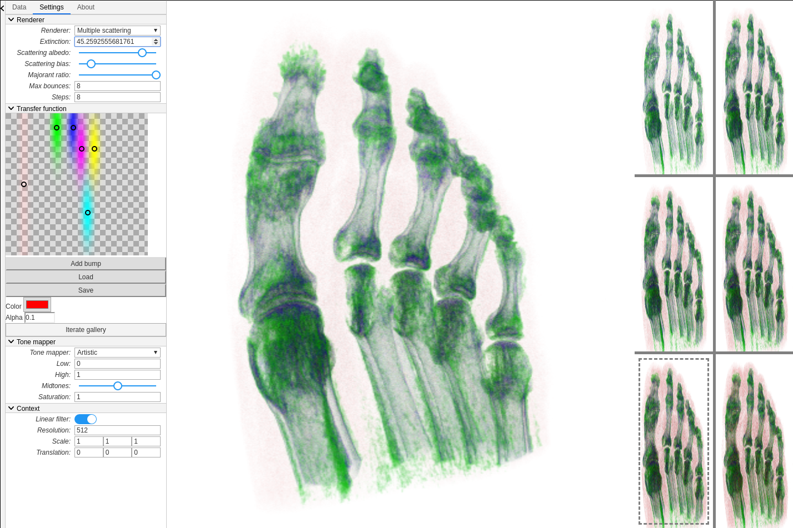

# NRG-seminal-work-VPT
This repository contains the code for the seminal work of the Masters studies course Advanced Computer Graphics. The original VPT repository is accessible at https://github.com/terier/vpt. 
We add the functionality of a design gallery to the original VPT application, which allows the user to create a transfer function iteratively, with visual feedback at each step.


## Contents: 
- `vpt/`: implementation
- `report/`: latex report files
- `test_data/`: test .bvp volume files

## How to run:
Prerequisite: NodeJS
```
cd vpt
make
./bin/server-node 	# Runs the server on localhost:3000
./bin/packer 		# Builds the project
```



